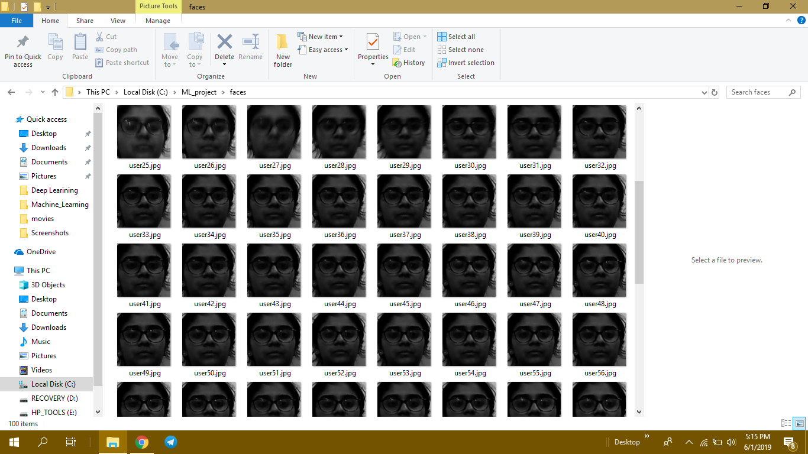
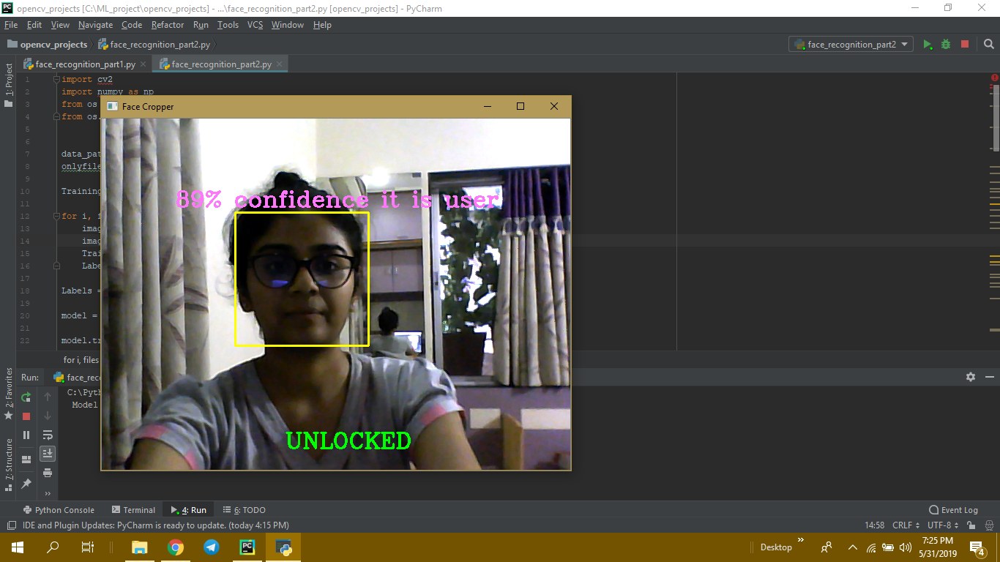
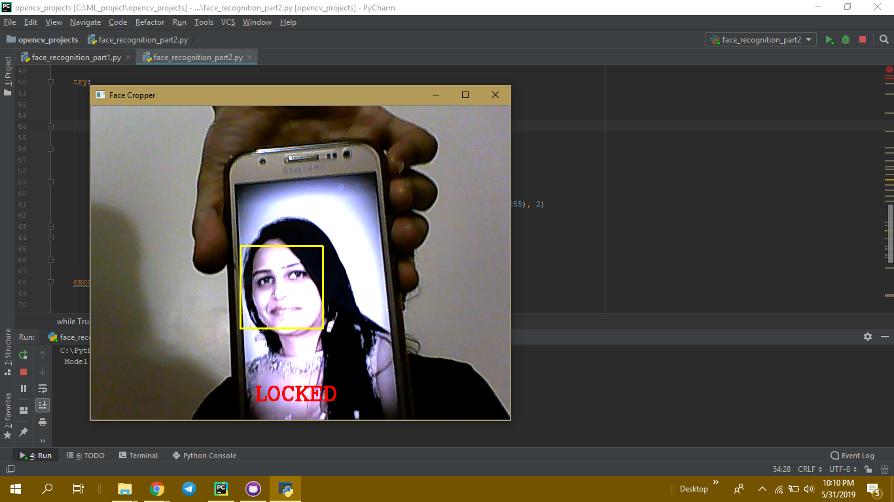

# Face_Recognition_System
In this Project i have used openCV library.
for installing opencv you can install from this link :
https://pypi.org/project/opencv-python/
and we are using Numpy
you can install it from :
https://pypi.org/project/numpy/

## Face_Recognition_part1 :
      In this part we are collecting samples of our face using openCV Library

    
## Face_Recognition_part2:
      In this part we are training a the model and we are making a system which will unlock when our face is matched
      if doesnot match it will lock.
      
      when your system is Unlock you can see in screenshot it shows the confidence how much it is user.
      

      when your system doesnot recognize your face it will show Locked.

